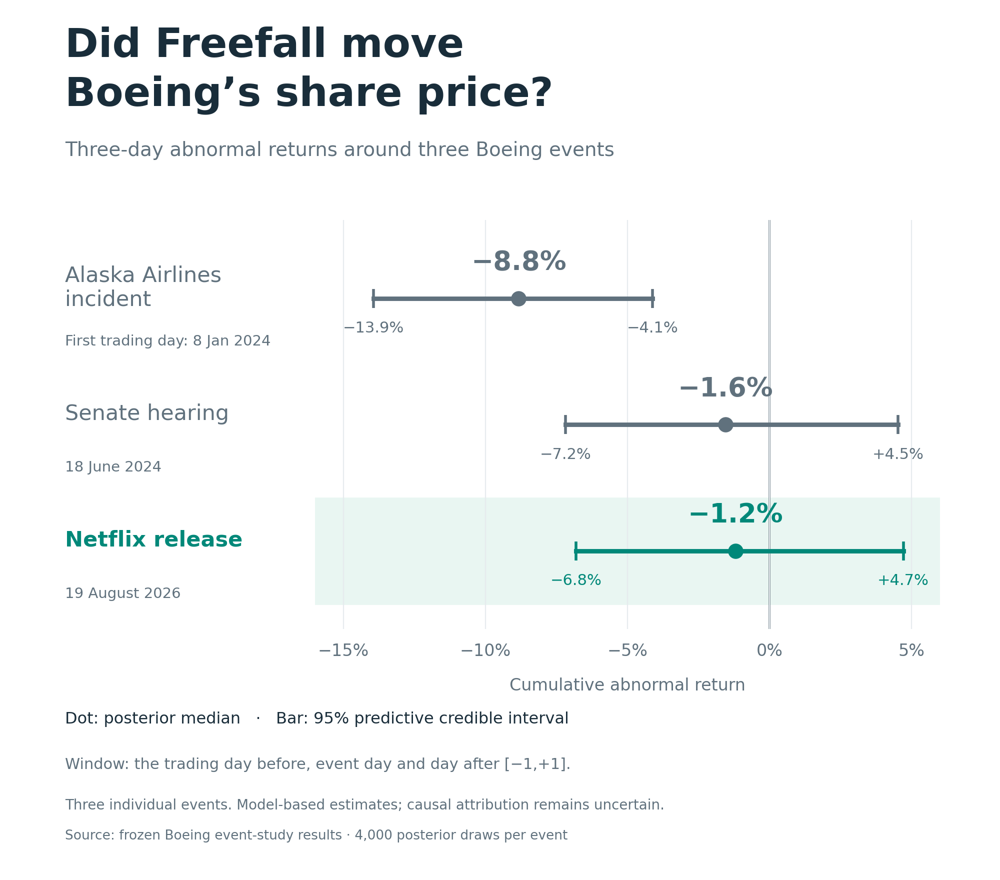

# Did Netflix's *Freefall* move Boeing's stock? A Bayesian event study

Reproducible data acquisition, Python analysis, and results accompanying Ludek Stehlik's [LinkedIn post](docs/linkedin-post.md) about *Freefall: A Reckoning for Boeing*. The question is whether the documentary's release coincided with a negative Boeing stock-market response, conditional on broad-market and aerospace/defense returns. The January 2024 Alaska Airlines door-plug incident and June 2024 Dave Calhoun Senate hearing provide two specific comparisons.

**Finding:** the Netflix release shows no clearly distinguishable negative response in the examined windows. Its three-day cumulative abnormal return (CAR) has a posterior predictive median of **−1.20%**, with a **95% credible interval of −6.82% to +4.71%**. This uncertainty does not rule out an economically meaningful effect. Share prices also cannot establish whether the film changed public trust, reputation, or employer attractiveness.

| Event | Event-day abnormal return | Three-day CAR `[-1,+1]` | Three-day 95% credible interval |
|---|---:|---:|---:|
| Alaska door-plug incident | −9.28% | −8.83% | [−13.95%, −4.11%] |
| Senate hearing | −2.13% | −1.55% | [−7.18%, +4.52%] |
| Netflix streaming release | +0.65% | −1.20% | [−6.82%, +4.71%] |

These are posterior predictive medians, rounded from [the saved Bayesian results](outputs/tables/bayesian_event_windows.csv). The theatrical-release sensitivity likewise has wide intervals containing zero.



> **These results compare three individual historical events. They do not identify a general population-level effect of safety incidents, congressional hearings, or documentaries.**

This is a **quasi-experimental event study**, not definitive proof of causal effects. The complete numerical findings, replication audit and release-timing sensitivity are in [the generated results report](report/results.md).

## Reproduce

Install [Git](https://git-scm.com/) and [uv](https://docs.astral.sh/uv/). The package supports Python 3.10 or newer; `.python-version` selects the tested 3.10 series and uv can provision it. Run these commands in a terminal (including PowerShell):

```bash
git clone https://github.com/lstehlik2809/boeing-freefall-stock-market-event-study.git
cd boeing-freefall-stock-market-event-study
uv sync --locked
uv run --locked python scripts/run_all.py
uv run --locked pytest -q
```

If uv is installed as a Python package but its executable is outside PATH, replace `uv` with `python -m uv`. No API keys or paid data subscriptions are required. The first run downloads eight pinned upstream CSVs (about 12.5 MB), validates them against the committed manifest, and generates the processed dataset, posterior draws, tables, PNG/SVG figures, diagnostic logs, and results report. Run the pipeline before pytest: integration tests require the reconstructed raw data and full outputs.

**Data availability:** this repository includes analysis-result CSVs, posterior draws, figures, and the exact input-data manifest. Underlying raw price histories and the full processed return panel are reconstructed by the downloader rather than redistributed here; see [data access and file formats](data/README.md) and the licensing explanation below. Initial reproduction requires access to the pinned upstream files and dependency packages.

To regenerate using the existing frozen local snapshot:

```bash
uv run --locked python scripts/run_all.py --skip-download
```

The offline analysis requires dependencies to have been installed already. The downloader is the only stage that accesses remote market data; subsequent stages read local files. Missing or altered raw files must fail checksum validation. Original raw data are not silently replaced. To study another snapshot, use a separate project copy with a deliberately updated source configuration and new manifest; do not mix snapshots.

The numbered scripts support separate download, preparation, Bayesian fitting, robustness and plotting stages. `scripts/run_all.py` is the authoritative end-to-end entry point. It also regenerates `report/results.md` from the resulting tables. The [original replication brief](docs/replication-brief.md) supplies historical targets and design context; the [updated post](docs/linkedin-post.md) uses the actual reproduced estimates. Neither document is read as a numerical input.

### Expected verification and troubleshooting

The pipeline reports **51/52 approximate reference checks within tolerance and one reviewed reference difference**, then `Full local reproduction complete`. The existing Netflix `[0,+10]` predictive median is +1.7956%, versus +1.4100% in the original brief. The raw failed check remains visible; [the validation report](report/validation.md) documents the diagnosis and narrowly scoped resolution. This is an approximate reproduction of the original brief, not an assertion that every target matches. The LinkedIn headline result uses the reproduced three-day estimate.

The verified environment is Windows with Python 3.10.7 and the locked packages. Other platforms may differ through numerical libraries; exact cross-platform bit identity is not asserted. Do not loosen tolerances to make a changed result pass. If the review gate fails, retain the diagnostic output and compare runtime versions and frozen-input hashes with [the execution log](outputs/logs/reproducibility.json).

A missing-file error with `--skip-download` means the local snapshot is incomplete: use the ordinary first-run command in a fresh clone. A checksum/source-change error deliberately stops reproduction; do not replace the committed manifest or silently switch to upstream `main`. The upstream repository refreshes its history, so availability of this pinned revision is an external dependency. Regenerated logs contain new timestamps, and figures/archives may have changed serialization metadata even when numerical results agree.

## Repository guide

| Path | Purpose |
|---|---|
| `config/` | Event dates, model settings, seed, contamination log, reference-difference evidence |
| `data/data_manifest.csv` | Exact upstream URLs, revision, download times, coverage, sizes, SHA-256 hashes |
| `data/raw/`, `data/processed/` | Local reconstructed price CSVs and return panel; excluded from Git |
| `src/boeing_event_study/` | Downloader, return construction, Gibbs sampler, OLS, placebos, plotting, validation |
| `scripts/01_…` through `scripts/08_…` | Individual analysis stages and LinkedIn illustrations |
| `scripts/run_all.py` | Complete reproduction, including the generated report |
| `scripts/diagnose_predictive_mc.py` | Separate predictive Monte Carlo diagnostic |
| `outputs/tables/`, `outputs/posterior/` | Published numerical results and simulation draws |
| `outputs/figures/`, `outputs/logs/` | Published illustrations, provenance, and numerical diagnostic |
| `report/results.md`, `report/validation.md` | Findings, limitations, and verification evidence |
| `report/sources/` | Event/source verification and news-search coverage |
| `docs/` | Updated LinkedIn post and original replication brief |
| `tests/`, `pyproject.toml`, `uv.lock` | Tests and reproducible package environment |

## Events

| ID | Event | Trading day zero |
|---|---|---|
| alaska | Alaska Airlines Flight 1282 door-plug incident, January 5, 2024 after the stock-market close | 2024-01-08 |
| hearing | Senate hearing with Boeing CEO Dave Calhoun | 2024-06-18 |
| netflix | *Freefall* Netflix streaming release, primary date | 2026-08-19 |
| theatrical | Limited theatrical release, sensitivity analysis | 2026-08-14 |

The theatrical date is an alternative timing analysis of the same film, not an independent fourth event for the principal comparisons. Sources and research limitations appear in [provenance notes](report/sources/provenance.md), [the contamination log](config/event_contamination.csv), and [research coverage](report/sources/contamination_research.md).

## Data and provenance

The eight CSVs come from [zjplab/US-Trading-Data](https://github.com/zjplab/US-Trading-Data) at immutable revision `14fec12f4af23d69633b6fd37e6d477facf0fa2b`: `data/SP500/{BA,RTX,LMT,NOC,GD,TDG,HWM}.csv` and `data/Indexes/^GSPC.csv`. The latter is saved locally as `GSPC.csv`. The repository uses Yahoo Finance through yfinance.

`data/data_manifest.csv` records URLs, revision, download times, row counts, date coverage, sizes and SHA-256 hashes. `outputs/logs/reproducibility.json` records the execution environment, random seed and raw hashes. A non-Git working directory is recorded explicitly rather than assigned an invented commit. Versioned configuration and the genuine `uv.lock` define the software environment.

Returns use **the supplied `Close` column**, `close[t] / close[t-1] - 1`, without log transformation or additional adjustment. The upstream downloader uses yfinance history defaults; these values should not be described as independently verified unadjusted closes. Price revisions or adjustment differences in another source can change numerical results.

The market trading-date calendar anchors alignment and relative-day indexing. Missing asset closes are not forward-filled and are not bridged into apparent one-day returns. The peer return is the equal-weighted mean of available RTX, LMT, NOC, GD, TDG and HWM returns, requiring at least five. The sector factor is `peer_return - market_return`. `data/processed/daily_returns.csv` preserves the required returns and BA volume. Event analysis requires complete usable observations in its specified windows rather than compressing the calendar to hide missing days.

### Data licensing

**Permission to redistribute the underlying market data has not been established.** The upstream repository's GPL-3.0 declaration does not establish Yahoo data rights. [yfinance's notice](https://github.com/ranaroussi/yfinance/blob/main/README.md) directs users to the provider's terms. Following the original brief's redistribution requirement, raw and processed market CSVs are kept locally and ignored by Git. The published downloader, configuration, source paths, manifest and hashes permit reconstruction. This project's [MIT license](LICENSE) applies to its original software/documentation, not third-party data. Users remain responsible for their use of upstream data.

## Model and computation

For each event, fit 221 pre-event trading observations at inclusive offsets **[-250,-30]**:

```text
BA_return[t] = alpha + beta_market * market_return[t]
                       + beta_sector * (peer_return[t] - market_return[t])
                       + error[t]
error[t] ~ Student-t(df=5, location=0, scale=sigma)
alpha ~ Normal(0, 0.01)
beta_market ~ Normal(1, 1)
beta_sector ~ Normal(1, 1)
sigma² ~ InverseGamma(shape=2, scale=0.0004)
```

Normal prior arguments above are mean and **standard deviation**. Coefficient priors are independent of `sigma²`. The Student-t scale is not its standard deviation: at df=5 its variance is `5/3 * sigma²`.

The Gibbs sampler uses `error[t] | lambda[t] ~ Normal(0, sigma²/lambda[t])` and `lambda[t] ~ Gamma(shape=2.5, rate=2.5)`. NumPy's Gamma argument is scale, the reciprocal of the stated rate. With `D=diag(0.01²,1,1)` and `m=(0,1,1)`, the coefficient conditional precision is `D^-1 + X' Lambda X / sigma²` and its mean is that precision's inverse times `D^-1 m + X' Lambda y / sigma²`. The variance conditional is `IG(2+n/2, 0.0004 + sum(lambda*residual²)/2)`; no coefficient-prior penalty is added. The latent-weight conditional is `Gamma(shape=3, rate=(5+residual²/sigma²)/2)`.

Base seed: **20260912**. Each fit uses 2,000 burn-in iterations and 4,000 retained draws with thinning 3. Deterministic separate random streams prevent accidental coupling of event simulations. Saved posterior files contain the fitted parameters and both uncertainty quantities; the sampler diagnostics provide basic Monte Carlo checks, not proof that the model identifies a causal effect.

### Two different uncertainty quantities

1. **Primary: posterior predictive abnormal return.** For each posterior draw and event day, simulate a fresh Student-t counterfactual innovation; subtract the resulting untreated return from observed BA return. Intervals include uncertainty about an unrealized daily return and model parameters.
2. **Secondary: parameter-only abnormal return.** Subtract only the fitted conditional mean. Intervals measure parameter uncertainty about that mean, excluding ordinary daily innovations. Narrower intervals for this quantity cannot be substituted for the primary intervals.

CAR is the **sum of daily abnormal returns**, not a compounded buy-and-hold return or a percentage change in market capitalization. For `[0,0]`, `[-1,+1]`, `[-3,+3]`, `[0,+5]` and `[0,+10]`, report mean, median, equal-tail 90%/95% credible intervals and the probabilities of CAR below 0, -1%, -3%, or within ±1%. Probabilities use strict inequalities. The last is an informal practical-equivalence measure, not a pre-registered equivalence test.

Direct comparisons use independently simulated event posterior CARs for the three principal events and report all pairwise and joint orderings. These calculations approximate a product of separately fitted posterior distributions. They do not estimate a joint structural model of all events or account for every dependence arising from shared historical information.

## Robustness and outputs

- OLS market/sector and market-only fits use the same 221 observations, with conventional residual-based abnormal returns and CARs.
- Placebos sum **all overlapping consecutive** L-day OLS residual blocks in the estimation period. Lower-tail extremeness is `block <= observed`; two-sided extremeness is `abs(block) >= abs(observed)`. Both use `(extreme_count+1)/(n_blocks+1)`. Overlapping blocks are dependent; these are empirical diagnostic tail areas, not exact randomized-experiment p-values.
- Volume uses the pre-event mean and sample SD (`ddof=1`) of log BA volume, reporting z-scores from -5 through +10.
- The entire film analysis is repeated with August 14 as day zero. The two film windows overlap and share information; this sensitivity does not create a second independent test of the film's effect.
- [Tables](outputs/tables/) include Bayesian summaries, independent event comparisons, OLS, placebos, volume, sampling diagnostics and every supplied replication target. [Figures](outputs/figures/) provide cumulative predictive CAR, a forest plot and abnormal volume in PNG and SVG.

The [LinkedIn illustration](outputs/figures/linkedin_three_day_forest.png) is a simplified three-row forest plot using only the predictive `[-1,+1]` window. Netflix is highlighted; dots show medians and bars show 95% credible intervals. An [editable SVG](outputs/figures/linkedin_three_day_forest.svg) is also saved. The full pipeline generates it automatically. To regenerate just this illustration from the saved summary table, run `uv run python scripts/06_make_linkedin_chart.py`.

The alternative [portrait LinkedIn CAR comparison](outputs/figures/linkedin_comparative_car_vertical.png) stacks the three event trajectories vertically with identical axes and predictive uncertainty bands. Its [SVG version](outputs/figures/linkedin_comparative_car_vertical.svg) is editable. It is also generated by the full pipeline, or separately with `uv run python scripts/07_make_linkedin_comparative_car.py`.

The [standalone Freefall chart](outputs/figures/linkedin_freefall_car.png) shows only the Netflix-release cumulative abnormal returns through day +10, with predictive uncertainty and a defined zero baseline at the preceding close. The square PNG is 2000 × 2000 pixels; an [editable SVG](outputs/figures/linkedin_freefall_car.svg) is also generated. Recreate it from saved posterior draws with `uv run --locked python scripts/08_make_linkedin_freefall.py`, or run the full pipeline.

The brief's approximate targets are checked using fixed diagnostic tolerances: 0.35 percentage points for medians, 0.75 percentage points for interval endpoints, 0.04 for probabilities and 0.15 for volume z-scores. Material deviations must be diagnosed, not fitted away. Sources of differences include price adjustments, date alignment, peer availability, inclusive indexing, prior parameterization, Gamma rate/scale, predictive innovation simulation and random streams.

## Causal interpretation and limitations

The approximate causal estimand is Boeing's observed return after an event minus the return expected on the same day had the focal event not occurred, conditional on contemporaneous broad-market and aerospace-sector movements. Interpreting the model's abnormal returns this way requires:

1. **No important simultaneous Boeing-specific confounder.** Other company news can produce the same measured residual.
2. **A stable pre-event market relationship.** The estimated relationship must remain valid during the event window.
3. **Sufficiently new information.** Known or anticipated information may already be reflected in prices.
4. **No major anticipation or information leakage outside the window.** The chosen dates may otherwise omit part of the response.
5. **Controls not substantially affected by the focal event.** Boeing is part of the S&P 500 and peers can experience spillovers; conditioning on affected controls may absorb some response.

The unexpected Alaska incident offers relatively stronger identification of an immediate shock. Even its first trading day bundles the incident with the weekend grounding and other information. The `[0,+5]` CAR is especially unsuitable as the effect of the original incident alone: FAA actions, inspections, airline responses and manufacturing news introduce mediators or additional treatments. The shortest windows support the most focused interpretation.

The scheduled Senate hearing is weaker for identification because scrutiny and some information were anticipated. The documentary has the weakest interpretation because publicity and release timing were known and it revisits earlier events. However, Netflix also describes new revelations; the amount of genuinely new investor-relevant information is not measured here. Stock prices cannot by themselves determine whether investors watched the film or changed their opinions.

The mandatory contamination log qualifies interpretation. It is not used to delete unfavorable observations or select cleaner windows after looking at returns. News coverage is not exhaustive, especially where searches are incomplete; absence from the log is not evidence of no confounding news. Peer selection, a single fixed estimation specification, multiple overlapping windows, possible volatility changes and conditional residual independence further limit interpretation.

**Failure to detect a stock-price effect does not imply no effect on reputation, trust, customer attitudes, employer attractiveness, employee identification or willingness to fly.** Share prices are an investor outcome weighted by capital, not a survey of the general population. Wide intervals containing zero also do not establish that an economically meaningful price response was absent.

## Attribution and reuse

Author: Ludek Stehlik. For software citation, use [CITATION.cff](CITATION.cff) and identify the repository commit, upstream data revision, and configuration you used. Credit the upstream market-data source separately. To report a reproduction problem, include your command, runtime versions, and the diagnostic message in a [GitHub issue](https://github.com/lstehlik2809/boeing-freefall-stock-market-event-study/issues).
