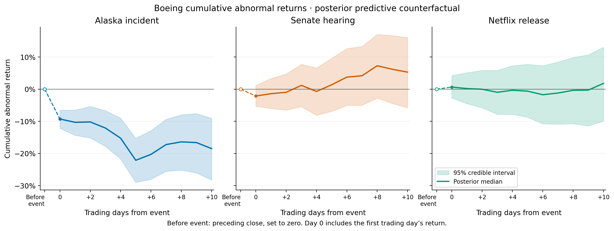
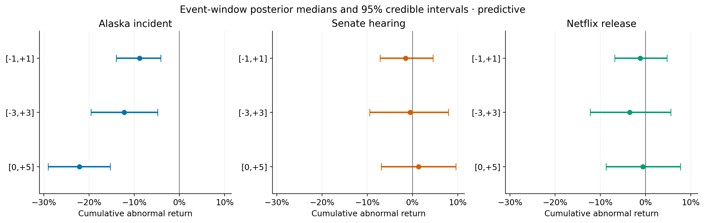
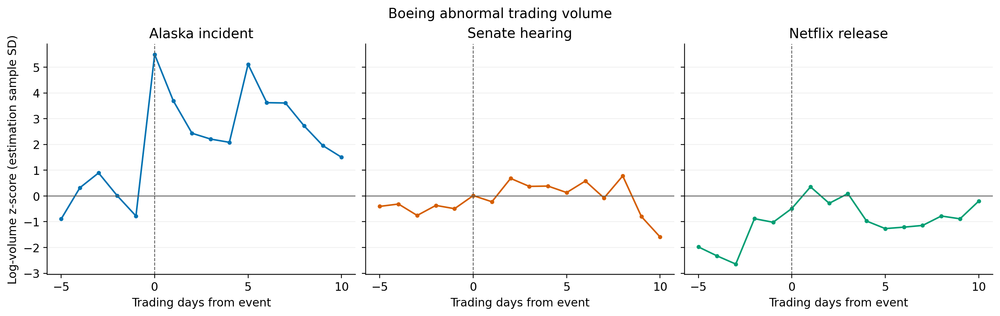

# Boeing event-study results

This report is regenerated from the frozen local inputs by `scripts/run_all.py`. Returns in the Bayesian display tables are percentages; machine-readable CSV returns are decimal fractions. Window endpoints are inclusive trading days.

> **These results compare three individual historical events. They do not identify a general population-level effect of safety incidents, congressional hearings, or documentaries.**

## What the estimates show

For Netflix's August 19, 2026 release, the three-day predictive CAR median is **-1.20%**, with a 95% credible interval of **[-6.82%, +4.71%]**. The probability of a negative CAR is **66.7%**, while the probability of a CAR within ±1% is **26.2%**. A wide interval is not proof of practical equivalence or absence of an economically meaningful response.

The Alaska incident's first trading day has a predictive abnormal-return median of **-9.28%**, with 95% interval **[-12.16%, -6.53%]**. It offers a comparison with one unusually large shock; it does not calibrate power for a small documentary effect or establish a general ranking of event categories.

## Primary posterior predictive results

| Event | Window | Median | 95% CrI | P(CAR<0) | P(CAR<-1%) | P(CAR<-3%) | P(|CAR|<1%) |
| --- | --- | --- | --- | --- | --- | --- | --- |
| Alaska incident | [0,0] | -9.28% | [-12.16%, -6.53%] | 1.000 | 0.999 | 0.998 | 0.001 |
| Alaska incident | [-1,+1] | -8.83% | [-13.95%, -4.11%] | 0.999 | 0.997 | 0.988 | 0.003 |
| Alaska incident | [-3,+3] | -12.23% | [-19.57%, -4.82%] | 0.998 | 0.996 | 0.990 | 0.004 |
| Alaska incident | [0,+5] | -22.13% | [-29.04%, -15.30%] | 1.000 | 1.000 | 1.000 | 0.000 |
| Alaska incident | [0,+10] | -18.50% | [-28.25%, -9.05%] | 1.000 | 0.999 | 0.998 | 0.001 |
| Senate hearing | [0,0] | -2.13% | [-5.34%, +1.12%] | 0.923 | 0.797 | 0.266 | 0.176 |
| Senate hearing | [-1,+1] | -1.55% | [-7.18%, +4.52%] | 0.723 | 0.590 | 0.292 | 0.229 |
| Senate hearing | [-3,+3] | -0.54% | [-9.49%, +7.94%] | 0.549 | 0.453 | 0.280 | 0.183 |
| Senate hearing | [0,+5] | +1.36% | [-6.91%, +9.59%] | 0.364 | 0.276 | 0.140 | 0.189 |
| Senate hearing | [0,+10] | +5.30% | [-5.78%, +16.04%] | 0.169 | 0.130 | 0.073 | 0.094 |
| Netflix streaming | [0,0] | +0.65% | [-2.74%, +4.21%] | 0.322 | 0.129 | 0.020 | 0.469 |
| Netflix streaming | [-1,+1] | -1.20% | [-6.82%, +4.71%] | 0.667 | 0.532 | 0.251 | 0.262 |
| Netflix streaming | [-3,+3] | -3.51% | [-12.24%, +5.59%] | 0.778 | 0.709 | 0.549 | 0.125 |
| Netflix streaming | [0,+5] | -0.61% | [-8.74%, +7.71%] | 0.563 | 0.466 | 0.274 | 0.187 |
| Netflix streaming | [0,+10] | +1.80% | [-9.90%, +13.02%] | 0.365 | 0.306 | 0.197 | 0.129 |

The underlying [Bayesian table](../outputs/tables/bayesian_event_windows.csv) also includes means and 90% intervals. Probabilities of CAR below -1% and -3% show why failure to separate an estimate from zero must not be described as ruling out downside. The ±1% measure is informal, not a pre-registered equivalence test.

## Documentary timing sensitivity

| Event | Window | Median | 95% CrI | P(CAR<0) | P(CAR<-1%) | P(CAR<-3%) | P(|CAR|<1%) |
| --- | --- | --- | --- | --- | --- | --- | --- |
| Netflix streaming | [0,0] | +0.65% | [-2.74%, +4.21%] | 0.322 | 0.129 | 0.020 | 0.469 |
| Netflix streaming | [-1,+1] | -1.20% | [-6.82%, +4.71%] | 0.667 | 0.532 | 0.251 | 0.262 |
| Netflix streaming | [-3,+3] | -3.51% | [-12.24%, +5.59%] | 0.778 | 0.709 | 0.549 | 0.125 |
| Netflix streaming | [0,+5] | -0.61% | [-8.74%, +7.71%] | 0.563 | 0.466 | 0.274 | 0.187 |
| Netflix streaming | [0,+10] | +1.80% | [-9.90%, +13.02%] | 0.365 | 0.306 | 0.197 | 0.129 |
| Theatrical sensitivity | [0,0] | -0.03% | [-3.51%, +3.38%] | 0.506 | 0.247 | 0.042 | 0.501 |
| Theatrical sensitivity | [-1,+1] | -1.72% | [-7.72%, +4.12%] | 0.733 | 0.606 | 0.322 | 0.224 |
| Theatrical sensitivity | [-3,+3] | -3.00% | [-11.93%, +6.23%] | 0.738 | 0.659 | 0.501 | 0.144 |
| Theatrical sensitivity | [0,+5] | -2.72% | [-11.14%, +5.62%] | 0.741 | 0.664 | 0.474 | 0.151 |
| Theatrical sensitivity | [0,+10] | -3.93% | [-15.14%, +7.18%] | 0.755 | 0.697 | 0.569 | 0.108 |

All five predictive 95% intervals contain zero for both film dates. Changing release timing therefore does not produce a clearly separated negative response in these windows. The theatrical release precedes Netflix streaming by three trading sessions. Some windows include both releases and the same other news, so these are overlapping sensitivity estimates, not independent replications. [Release metadata](https://www.rottentomatoes.com/m/freefall_a_reckoning_for_boeing) supports August 14 and August 19 respectively.

## Direct comparisons of these events

| window | uncertainty | p_alaska_lt_hearing | p_hearing_lt_netflix | p_alaska_lt_netflix | p_alaska_lt_hearing_lt_netflix |
| --- | --- | --- | --- | --- | --- |
| [0,0] | predictive | 0.997 | 0.89775 | 0.9995 | 0.89475 |
| [-1,+1] | predictive | 0.9745 | 0.53425 | 0.97525 | 0.5105 |
| [-3,+3] | predictive | 0.974 | 0.326 | 0.92825 | 0.30425 |
| [0,+5] | predictive | 1 | 0.37375 | 0.9995 | 0.37375 |
| [0,+10] | predictive | 0.9995 | 0.33125 | 0.99425 | 0.33075 |
| [0,0] | parameter_only | 1 | 1 | 1 | 1 |
| [-1,+1] | parameter_only | 1 | 0.63825 | 1 | 0.63825 |
| [-3,+3] | parameter_only | 1 | 0.00325 | 1 | 0.00325 |
| [0,+5] | parameter_only | 1 | 0.02425 | 1 | 0.02425 |
| [0,+10] | parameter_only | 1 | 0.0285 | 1 | 0.0285 |

These probabilities use independent draws from separately fitted event posteriors. They are conditional comparisons of the Alaska incident, this hearing and this streaming release. They do not estimate the frequency with which accidents outperform hearings or documentaries in other settings. Shared historical information and control-factor spillovers are not modeled as a joint cross-event structure.

## OLS, placebos and volume

Both OLS specifications use the same inclusive [-250,-30] estimation period. The following selected results use decimal-fraction return units.

| event | event_date | specification | window | n_days | car |
| --- | --- | --- | --- | --- | --- |
| alaska | 2024-01-08 | market_sector | [0,0] | 1 | -0.0936421 |
| alaska | 2024-01-08 | market_sector | [-1,+1] | 3 | -0.0892643 |
| alaska | 2024-01-08 | market_sector | [0,+5] | 6 | -0.221764 |
| alaska | 2024-01-08 | market_only | [0,0] | 1 | -0.0940575 |
| alaska | 2024-01-08 | market_only | [-1,+1] | 3 | -0.0910619 |
| alaska | 2024-01-08 | market_only | [0,+5] | 6 | -0.221164 |
| hearing | 2024-06-18 | market_sector | [0,0] | 1 | -0.0211824 |
| hearing | 2024-06-18 | market_sector | [-1,+1] | 3 | -0.0143691 |
| hearing | 2024-06-18 | market_sector | [0,+5] | 6 | 0.0141108 |
| hearing | 2024-06-18 | market_only | [0,0] | 1 | -0.0195596 |
| hearing | 2024-06-18 | market_only | [-1,+1] | 3 | -0.00681678 |
| hearing | 2024-06-18 | market_only | [0,+5] | 6 | 0.00741035 |
| netflix | 2026-08-19 | market_sector | [0,0] | 1 | 0.0053206 |
| netflix | 2026-08-19 | market_sector | [-1,+1] | 3 | -0.0148167 |
| netflix | 2026-08-19 | market_sector | [0,+5] | 6 | -0.0110296 |
| netflix | 2026-08-19 | market_only | [0,0] | 1 | -0.00565017 |
| netflix | 2026-08-19 | market_only | [-1,+1] | 3 | -0.0312694 |
| netflix | 2026-08-19 | market_only | [0,+5] | 6 | -0.0436183 |
| theatrical | 2026-08-14 | market_sector | [0,0] | 1 | 9.5552e-05 |
| theatrical | 2026-08-14 | market_sector | [-1,+1] | 3 | -0.0178549 |
| theatrical | 2026-08-14 | market_sector | [0,+5] | 6 | -0.0293499 |
| theatrical | 2026-08-14 | market_only | [0,0] | 1 | 0.00845287 |
| theatrical | 2026-08-14 | market_only | [-1,+1] | 3 | -0.0200512 |
| theatrical | 2026-08-14 | market_only | [0,+5] | 6 | -0.0492058 |

For each OLS model and L-day event window, placebos are all overlapping consecutive sums of pre-event residuals. Lower-tail extremeness is `block <= observed CAR`; two-sided extremeness is `abs(block) >= abs(observed CAR)`. The finite-sample correction is `(extreme_count+1)/(number_of_blocks+1)`. Because the residual blocks overlap, these are empirical reference tail areas, not exact randomization-test p-values.

| event | event_date | specification | window | n_days | car | p_lower | p_two_sided | n_placebos |
| --- | --- | --- | --- | --- | --- | --- | --- | --- |
| alaska | 2024-01-08 | market_sector | [0,0] | 1 | -0.0936421 | 0.0045045 | 0.0045045 | 221 |
| alaska | 2024-01-08 | market_sector | [-1,+1] | 3 | -0.0892643 | 0.00454545 | 0.0181818 | 219 |
| alaska | 2024-01-08 | market_sector | [0,+5] | 6 | -0.221764 | 0.00460829 | 0.00460829 | 216 |
| alaska | 2024-01-08 | market_only | [0,0] | 1 | -0.0940575 | 0.0045045 | 0.0045045 | 221 |
| alaska | 2024-01-08 | market_only | [-1,+1] | 3 | -0.0910619 | 0.00454545 | 0.0136364 | 219 |
| alaska | 2024-01-08 | market_only | [0,+5] | 6 | -0.221164 | 0.00460829 | 0.00460829 | 216 |
| hearing | 2024-06-18 | market_sector | [0,0] | 1 | -0.0211824 | 0.0810811 | 0.153153 | 221 |
| hearing | 2024-06-18 | market_sector | [-1,+1] | 3 | -0.0143691 | 0.286364 | 0.572727 | 219 |
| hearing | 2024-06-18 | market_sector | [0,+5] | 6 | 0.0141108 | 0.672811 | 0.709677 | 216 |
| hearing | 2024-06-18 | market_only | [0,0] | 1 | -0.0195596 | 0.0855856 | 0.175676 | 221 |
| hearing | 2024-06-18 | market_only | [-1,+1] | 3 | -0.00681678 | 0.431818 | 0.827273 | 219 |
| hearing | 2024-06-18 | market_only | [0,+5] | 6 | 0.00741035 | 0.576037 | 0.889401 | 216 |
| netflix | 2026-08-19 | market_sector | [0,0] | 1 | 0.0053206 | 0.648649 | 0.711712 | 221 |
| netflix | 2026-08-19 | market_sector | [-1,+1] | 3 | -0.0148167 | 0.272727 | 0.554545 | 219 |
| netflix | 2026-08-19 | market_sector | [0,+5] | 6 | -0.0110296 | 0.382488 | 0.751152 | 216 |
| netflix | 2026-08-19 | market_only | [0,0] | 1 | -0.00565017 | 0.346847 | 0.68018 | 221 |
| netflix | 2026-08-19 | market_only | [-1,+1] | 3 | -0.0312694 | 0.15 | 0.318182 | 219 |
| netflix | 2026-08-19 | market_only | [0,+5] | 6 | -0.0436183 | 0.16129 | 0.341014 | 216 |
| theatrical | 2026-08-14 | market_sector | [0,0] | 1 | 9.5552e-05 | 0.518018 | 1 | 221 |
| theatrical | 2026-08-14 | market_sector | [-1,+1] | 3 | -0.0178549 | 0.259091 | 0.490909 | 219 |
| theatrical | 2026-08-14 | market_sector | [0,+5] | 6 | -0.0293499 | 0.230415 | 0.451613 | 216 |
| theatrical | 2026-08-14 | market_only | [0,0] | 1 | 0.00845287 | 0.734234 | 0.54955 | 221 |
| theatrical | 2026-08-14 | market_only | [-1,+1] | 3 | -0.0200512 | 0.263636 | 0.518182 | 219 |
| theatrical | 2026-08-14 | market_only | [0,+5] | 6 | -0.0492058 | 0.142857 | 0.281106 | 216 |

Event-day abnormal log-volume z-scores and their associated metadata:

| event | event_date | date | relative_day | ba_volume | volume_z | estimation_log_volume_mean | estimation_log_volume_sd |
| --- | --- | --- | --- | --- | --- | --- | --- |
| alaska | 2024-01-08 | 2024-01-08 | 0 | 4.07304e+07 | 5.49501 | 15.4555 | 0.376159 |
| hearing | 2024-06-18 | 2024-06-18 | 0 | 6.1799e+06 | 0.0150853 | 15.6293 | 0.500339 |
| netflix | 2026-08-19 | 2026-08-19 | 0 | 5.7975e+06 | -0.484824 | 15.7488 | 0.362695 |
| theatrical | 2026-08-14 | 2026-08-14 | 0 | 2.6491e+06 | -2.67025 | 15.7542 | 0.361195 |

The baseline uses the estimation-period mean and sample SD (`ddof=1`) of log volume. The complete [volume table](../outputs/tables/volume_event_study.csv) covers -5 through +10. Full OLS/placebo window results are saved in [the tables directory](../outputs/tables/). Volume is an additional investor-activity outcome, not a direct sentiment measure.

## Uncertainty, model and replication audit

The fixed-df Student-t model uses BA returns as a function of an intercept, S&P 500 returns and equal-weighted peer returns minus S&P 500 returns. The peers are RTX, LMT, NOC, GD, TDG and HWM, with at least five available. Each event has 221 pre-event observations. Priors are independent Normal(0,0.01) for the intercept, Normal(1,1) for each beta (standard deviations), and InverseGamma(shape=2,scale=0.0004) for sigma². The normal/Gamma Gibbs sampler fixes df=5, seed=20260912, burn-in=2000, retained draws=4000 and thinning=3. See [README](../README.md) for the conditional equations and reproduction instructions.

The **primary predictive** counterfactual simulates both parameter uncertainty and a fresh daily Student-t innovation. The **parameter-only** counterfactual subtracts the fitted conditional mean and excludes ordinary daily innovations. Below are short-window secondary summaries; they must not be substituted for primary uncertainty intervals.

| Event | Window | Median | 95% CrI | P(CAR<0) | P(CAR<-1%) | P(CAR<-3%) | P(|CAR|<1%) |
| --- | --- | --- | --- | --- | --- | --- | --- |
| Alaska incident | [0,0] | -9.29% | [-9.60%, -9.01%] | 1.000 | 1.000 | 1.000 | 0.000 |
| Alaska incident | [-1,+1] | -8.87% | [-9.40%, -8.34%] | 1.000 | 1.000 | 1.000 | 0.000 |
| Senate hearing | [0,0] | -2.14% | [-2.36%, -1.92%] | 1.000 | 1.000 | 0.000 | 0.000 |
| Senate hearing | [-1,+1] | -1.50% | [-2.21%, -0.77%] | 1.000 | 0.908 | 0.000 | 0.092 |
| Netflix streaming | [0,0] | +0.62% | [+0.22%, +1.03%] | 0.001 | 0.000 | 0.000 | 0.966 |
| Netflix streaming | [-1,+1] | -1.28% | [-2.16%, -0.39%] | 0.998 | 0.739 | 0.000 | 0.261 |
| Theatrical sensitivity | [0,0] | +0.01% | [-0.33%, +0.37%] | 0.474 | 0.000 | 0.000 | 1.000 |
| Theatrical sensitivity | [-1,+1] | -1.67% | [-2.28%, -1.04%] | 1.000 | 0.981 | 0.000 | 0.019 |

CAR is a sum of daily abnormal returns, not a compounded wealth return. Credible intervals are equal-tail quantiles. All posterior parameter and abnormal-return simulations are saved under [posterior](../outputs/posterior/).

The [replication audit](../outputs/tables/replication_diagnostics.csv) contains **52 reference checks** from the brief, with observed values, reference values, differences and fixed tolerances. A failed check requires diagnosis rather than changing the model or widening a tolerance. [Sampler diagnostics](../outputs/tables/sampler_diagnostics.csv) and [execution provenance](../outputs/logs/reproducibility.json) record additional numerical/environment evidence. Passing approximate targets is not proof of causal identification. See `validation.md` for the actual final verification record and any diagnosis.

**51 of 52 checks fall within the original fixed tolerances.** The following differences remain outside tolerance and are explicitly retained in the audit, even when a documented review permits the pipeline to continue:

| event | window | metric | target | actual | absolute_difference | tolerance | passed |
| --- | --- | --- | --- | --- | --- | --- | --- |
| netflix | [0,+10] | median | 0.0141 | 0.0179563 | 0.00385626 | 0.0035 | False |

The Netflix [0,+10] median differs by 0.386 percentage points from the supplied approximate reference. Its separately saved Monte Carlo diagnostic supports possible simulation variability but cannot establish the original discrepancy's exact cause without the original snapshot and random draws. This is an approximate reproduction with a disclosed reference difference, not an exact numerical match. Production draws, the model and the original tolerance were retained. A narrowly bound review record permits only this same documented difference; other unreviewed discrepancies still stop the pipeline.

## Identification and competing news

This is a **quasi-experimental event study**, not definitive proof of causation. The approximate estimand is Boeing's observed return after the event minus its expected same-day return had the focal event not occurred, conditional on contemporaneous broad-market and aerospace-sector movements.

That interpretation requires (1) no important simultaneous Boeing-specific confounder; (2) a stable pre-event market relationship during the event window; (3) sufficiently new information; (4) no major anticipation or information leakage outside the chosen window; and (5) market and peer controls not substantially affected by the focal event. Boeing's inclusion in the S&P 500 and possible peer spillovers limit the last assumption. The model also imposes a fixed residual scale and conditionally independent daily innovations, which may miss changing volatility or dependence.

The unexpected Alaska incident supports relatively stronger identification of an immediate shock, although the first tradable day already bundles the incident with weekend regulatory actions. Its large [0,+5] loss includes follow-on FAA actions, inspections, airline decisions and additional manufacturing news; these can be mediators or additional treatments. It cannot be cleanly assigned to the original incident alone. The shortest windows have the most focused interpretation.

The scheduled Senate hearing has weaker identification because scrutiny and some information were anticipated. The documentary has the weakest identification because it revisits earlier events and had known release/publicity timing. However, [Netflix's own description](https://media.netflix.com/en/only-on-netflix/81780118) refers to new revelations: this analysis has not measured how much information was new to investors. Prior pricing of information is a plausible explanation, not an established finding.

The mandatory [contamination log](../config/event_contamination.csv) and [coverage notes](sources/contamination_research.md) document competing information around all four dates. The log qualifies interpretation; no observations are removed based on their returns. Searches are not exhaustive, and missing entries do not establish an absence of competing news. Model choice, selected peers, overlapping windows and multiple comparisons further restrict generalization.

## What share prices cannot tell us

Failure to detect a stock-price effect does **not** imply the documentary had no effect on trust, reputation, customer attitudes, employer attractiveness, employee identification or willingness to fly. Investors' capital-weighted choices are not public-opinion survey responses. This design does not identify documentary viewership, opinions, or a pathway from opinions to trading.

## Provenance and availability

The [data manifest](../data/data_manifest.csv) identifies all eight local raw files downloaded from upstream Git revision `14fec12f4af23d69633b6fd37e6d477facf0fa2b`. The supplied Close column is used for simple returns without extra adjustment. [Source notes](sources/provenance.md) explain the vendor-adjustment and licensing limitations. Raw and processed market CSVs remain local and excluded from Git because redistribution permission has not been established. Software, configuration, source paths, hashes and locked dependencies support reconstruction; upstream availability remains an external dependency.

## Figures

Each figure also has an SVG version in [the figure directory](../outputs/figures/).
